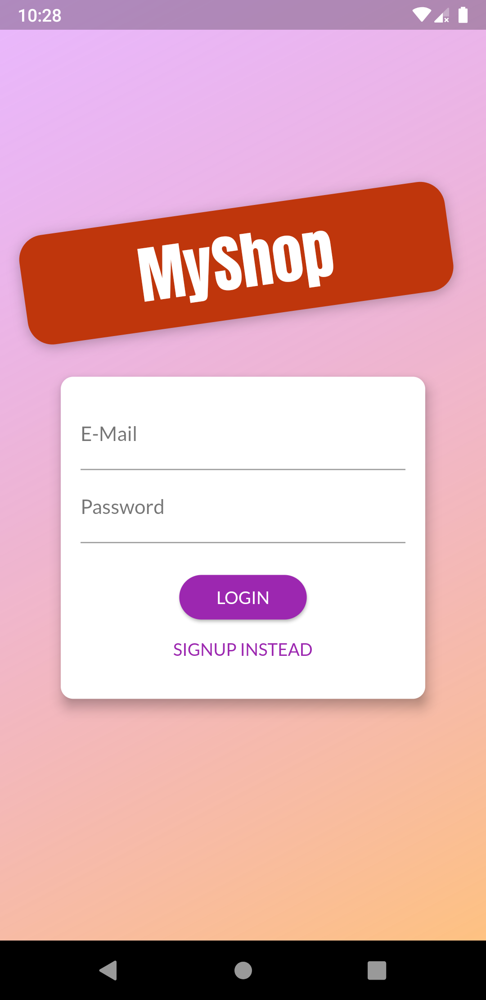
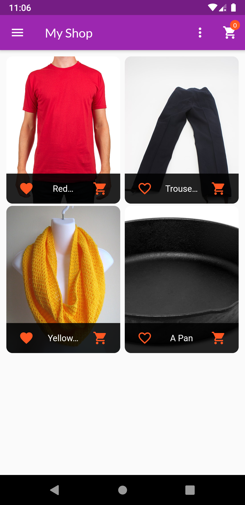
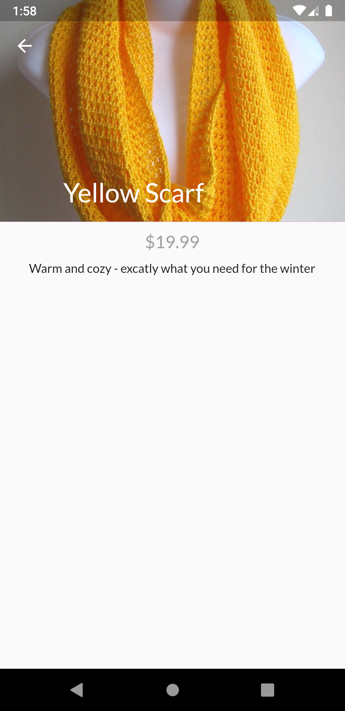
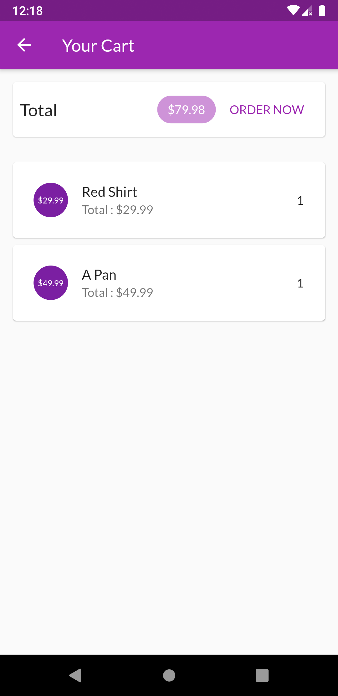
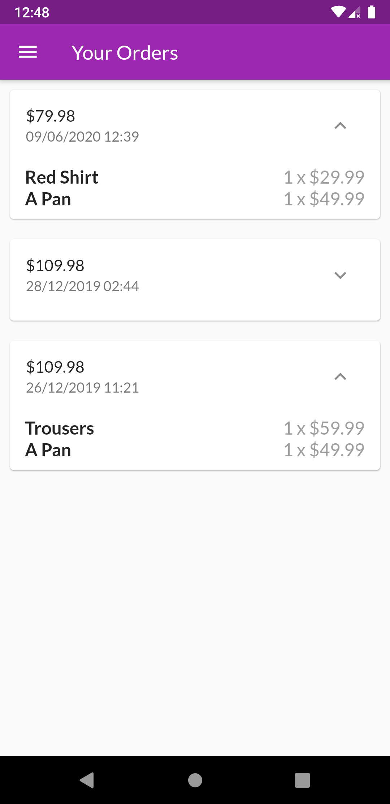
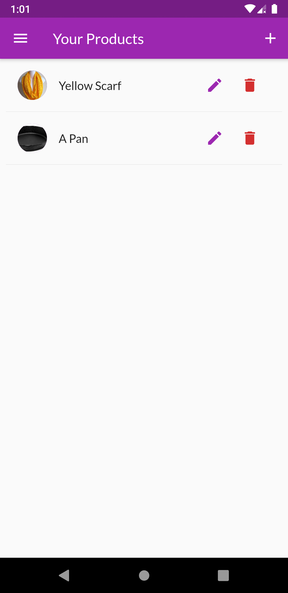
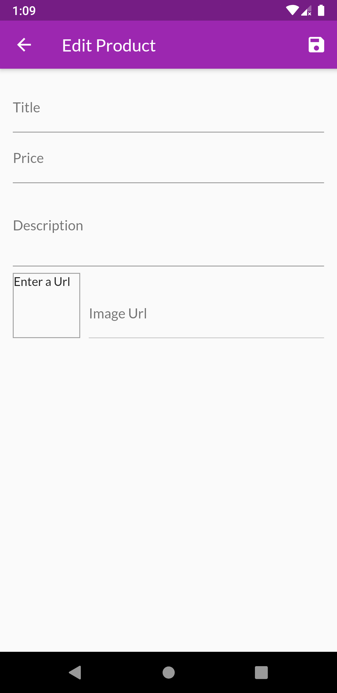
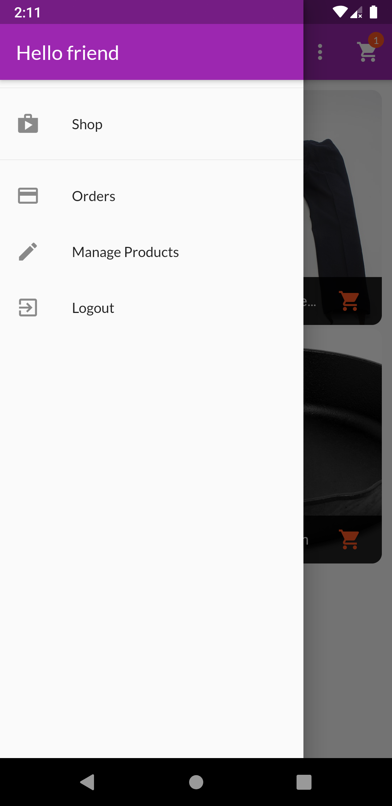

# Shop App

This app is a simple shop app where you can order items, purchase items, and add items.

## Auth Screen

      

The app will first ask for a login/signup if opened for the first time. If the user is already logged in then, My Shop screen will be opened. The login page only asks for email/password and signUp asks for email/password/confirm password. If any error persists on Login/Signing Up; a dialogue will be shown describing the error.

## My Shop Screen

    

The shop screen has the following components:
- The app bar has an icon for opening and closing the drawer, the drop-down menu toggles between only favorites and all, and the cart button will take to the cart screen(the bubble above the cart symbol shows the number of items in cart)
- The body contains the list of items in which each item has item image, item title, add to cart button and add to favorites button.
- On pressing the 'Add to cart' button, a snack bar is shown in case of undoing the product from the cart.
- To add the same item multiple items just press the cart button multiple times.

## Product Screen

    

The product page is the detailed described page of a particular product. It's components are :
- The page consists of an App bar with the background image of the product and the title as a product name.
- The body consists of a description and price of the product.

## Cart Screen

    

The cart screen has the following components:
- The Total area shows the total amount of items in the cart. On pressing 'order now' the cart will be cleared and this order is added to the orders list.
- The List contains the items that are added to the cart. Each item can be removed by swiping the item from right to left. A dialogue box is shown for the confirmation of deleting the item from the cart. 

## Orders Screen

    

The orders page has the following components:
- The orders page has a list of orders.
- Each order has a dropdown, which can be opened or closed. The item contains the total cost of the order and the time stamp of the order. On opening shows the list of items ordered with the quantity and total price of each product. 

## Products Screen

    

The Products Screen has the following components:
- The product screen is a list of items owned by the user.
- Each product can be deleted or edited. The user can delete the product by pressing the delete button. The user can edit the product by pressing the edit button.
- On pressing the edit button, the user will be taken to edit the product screen with the values initialized to current values in the form.
- On pressing the add button on the app bar, the user is taken to edit product screen with no values initialized.

## Add/Edit Products Screen

    

The edit products page is a form for adding or editing the product. It has the following components:
- The title text field for the name of the product.
- The price field for the price in dollars.
- The description field for the description of the product.
- Image Url is the URL of the image of the product. A preview of the image is shown in the container on the left.
- The save button at the app bar adds/edits the product.     

## App Drawer

    

The app drawer is used to navigate to mostly all screens of the app:
- The 'shop' option leads us to My Shop screen.
- The 'orders' option leads us to the Orders screen.
- The 'manage products' option leads us to products screen.
- The 'logout' option logs us out and leads us to the Auth screen. 

## Further Improvements

Further improvements are as follows :
- The app doesn't differentiate between the buyers and sellers. Anyone can post a new product and anyone can order it. There is no special profile for the user.
- In case of adding more items to the cart, the user needs to remove the whole set and again add it.
- Though the app's data is stored in firebase's realtime database, all the features of firebase are not used. Instead only the API links are used as HTTP requests to the app and everything is handled here in the app.
- There are many UI components that can be improved. 

## Download
The apk file can be downloaded from [here](https://drive.google.com/file/d/1BDviE85YSct3jldrrpUcTCGvw_AV-hmO/view?usp=sharing).
